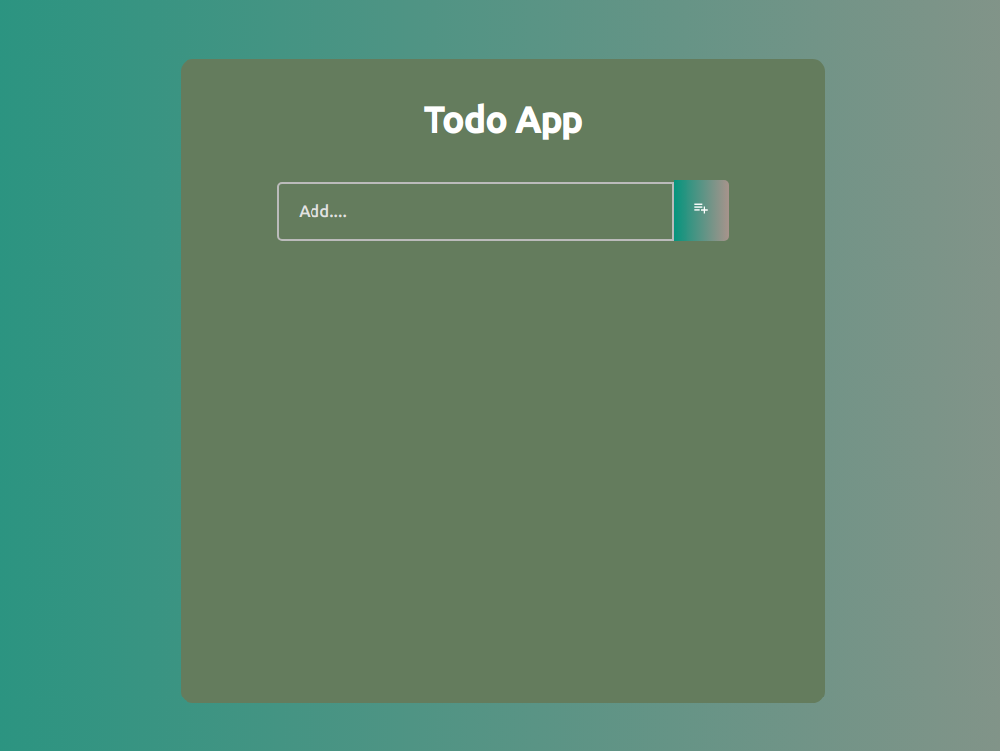
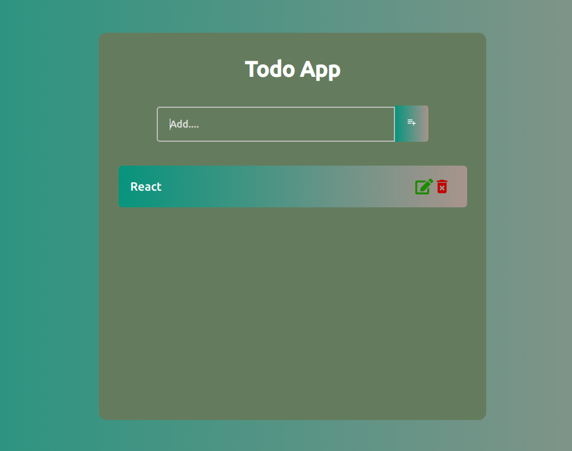

This project was bootstrapped with [Create React App](https://github.com/facebook/create-react-app).

## Available Scripts

In the project directory, you can run:

### `npm start`

#### Live On: [view](https://react-todo-list-app-1.netlify.app/)

### Screenshot:

